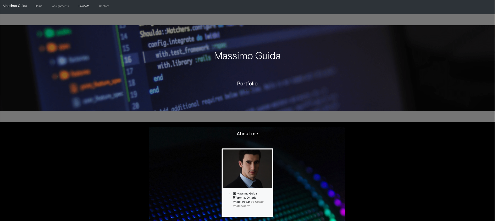

# Assignment 20 – React Homework: React Portfolio

## Description

The following application is a portfolio containing a number of my recent assignments and projects, which I have built using React

## Application Screenshot

## Accesories and Technologies Used:
* HTML
* CSS
* [Bootstrap](https://getbootstrap.com/)
* [Font Awesome](https://fontawesome.com/)
* [Google Fonts](https://fonts.google.com/)
* JSX
* React
* JSON
* Web Manifest
* Service Worker
* [Visual Studio Code](https://code.visualstudio.com/)
* [Google Chrome](http://www.google.com/chrome)
* [Node.js](https://nodejs.org/en/)
* Git/Terminal
* [GitHub](https://github.com/)
* [Netlify](https://www.netlify.com/)

## Deployed Links
  
  * Link to the deployed URL: https://nifty-lumiere-ded15c.netlify.app/

  * Link to the GitHub repository: https://github.com/MG-cpu90/assignment20